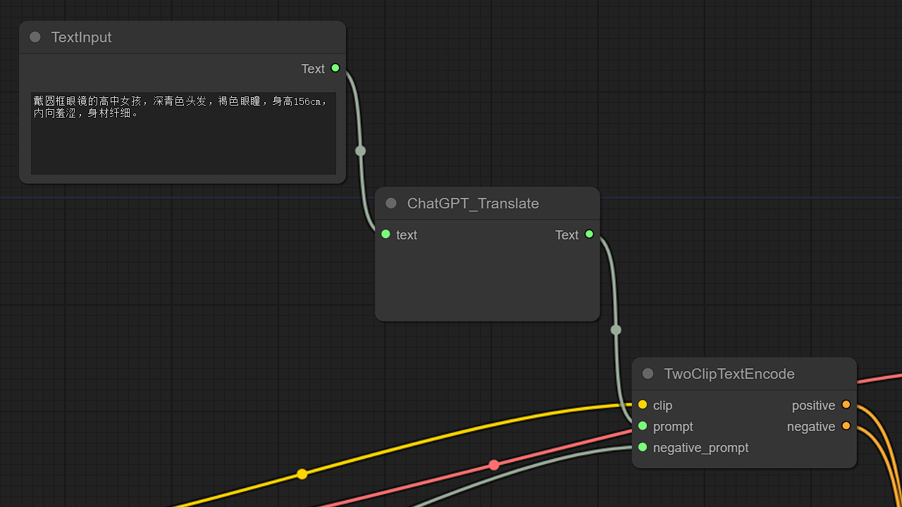
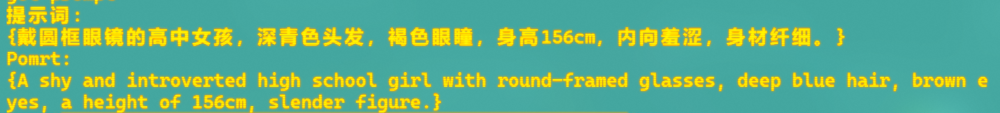

简单的节点，轻量级，0秒级读取，自用存档。

每个节点都是独立代码，没有做抽象整合，可以将.py文件直接拉到custom_nodes文件目录使用

起因是想要一个简单文本输入框来存些预设，但一直没找到😡

看大佬们做的各种节点都很好，功能很多，非常Coooooool!!!

就是太复杂了，而且跟我的A卡+ZLUDA组合有些奇奇怪怪的BUG。

干脆就自己开整。

目前有三个节点：

    TextInput:

        一个简单的文本输入框，可以输出String格式的文本
---

    ChatGPT_Translate:

        ①接收String格式的内容，通过ChatGPT翻译成英文
        
            Tips:需要添加环境变量ChatGPT_API_KEY，变量值为你的API密钥。
            
                或在代码内填入密钥(不推荐)

        ②通过终端显示提示词:

---
    TwoClipTextEncode:

        将prompt和negative_prompt二合一，仅仅是为了简洁和好看
---
ChatGPT使用的是代理[GPT_API_free](https://github.com/chatanywhere/GPT_API_free)

当初买了三十块的APIKEY，一年多才用五块，可能是我太懒了吧😀

应该可以试试白嫖，反正也就翻译翻译几个单词，使用量不大，限制无关紧要。

# 感谢
[ComfyUI_Custom_Nodes_AlekPet](https://github.com/AlekPet/ComfyUI_Custom_Nodes_AlekPet)

[cg-utilities](https://github.com/chrisgoringe/cg-utilities)